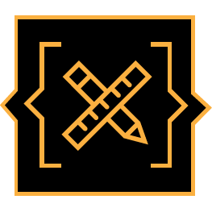

# Front-end Meetup Skopje (FEMUSK)

## Инфо за одржување средби

- одржани технички средби: https://github.com/femusk/meetups/blob/master/held-meetups.md

### Кога и каде

- Секој втор вторник во месецот (со ретки исклучоци, најавени на време).
- Почеток: 19:00 ч.
- [хаклаб КИКА](https://www.openstreetmap.org/?mlat=41.99856&mlon=21.42485#map=19/41.99856/21.42485)

### Формат

- Презентации од по 15 - 20 мин, со 5 мин дискусија.
- Максимален број на презентации за една средба е 3 (првата беше исклучок).
- Ако сакаш да презентираш а нема место, запиши се за наредната средба.
- Ако не можеш да ја одржиш презентацијата што си ја пријавил/а, најави што порано - може некој/а ќе може да го превземе терминот.
- Бидејќи настанот е од отворен карактер, секоја средба се објавува на блогот на хаклаб КИКА -- http://b10g.spodeli.org/

### Теми

HTML, CSS, JavaScript, Web технологии, UI, UX, дизајн, перформанс, браузери, WordPress, библиотеки, начини на работа, фронт-енд архитектури....

### Имам тема за презентирање. Како да ја најавам?

- ~~Во отворен документ на адреса: http://piratepad.net/yyU20gfYrf~~
- Име на тема и име на предавач/ка
- Краток опис
- За кого е наменета / ниво

### За известување кога има следна средба

- http://www.meetup.com/Skopje-Front-End-Meetup
- https://www.facebook.com/groups/641109609255699
- http://b10g.spodeli.org
- https://twitter.com/FrontEndSK

### Отворена листа за дискусија

- инфо: https://lists.softver.org.mk/listinfo/front-end
- архива: https://lists.softver.org.mk/pipermail/front-end
